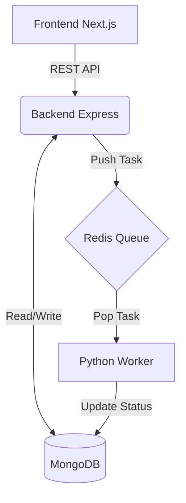
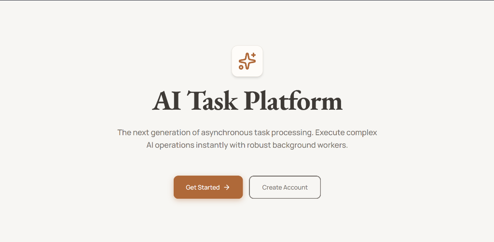
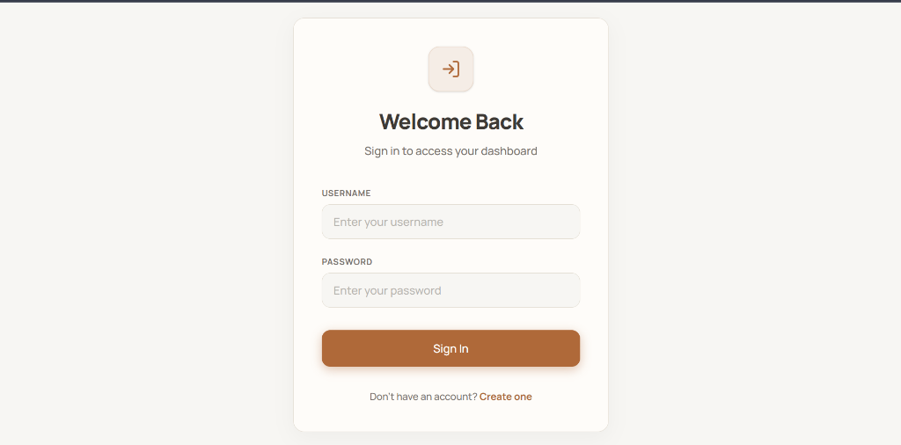
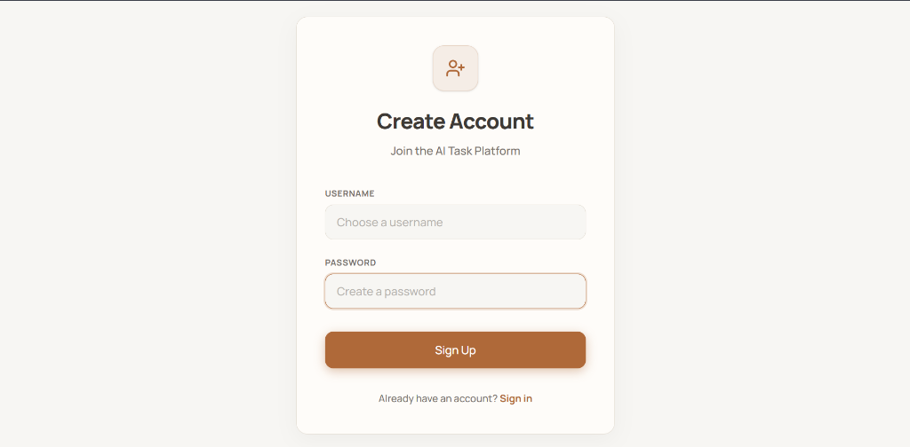
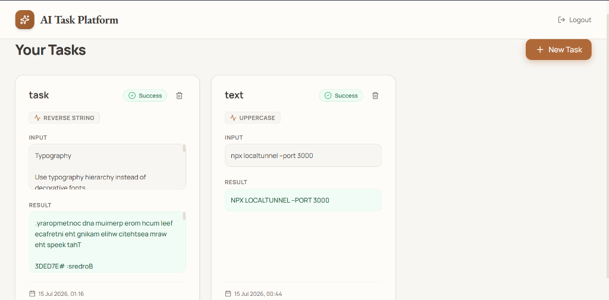
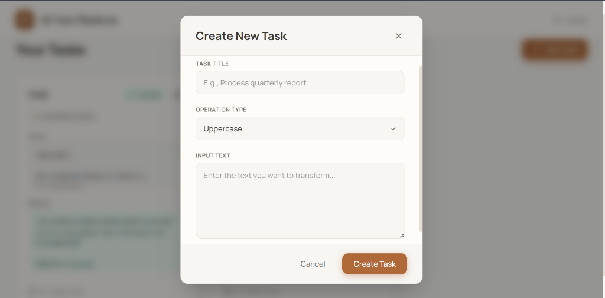

# 🚀 AI Task Processing Platform




A production-ready, scalable microservices architecture designed to handle asynchronous AI task processing. Built as a comprehensive full-stack assessment, this project demonstrates modern best practices in containerization, decoupled architectures, and continuous deployment.

## 🏗️ Architecture Overview

The system is designed with a decoupled architecture to ensure high availability and scalable background processing:

- **Frontend (Next.js 14+)**: A responsive, mobile-first React application utilizing App Router and Tailwind CSS. Features an elegant glassmorphic UI, JWT-based authentication, and real-time dashboard polling.
- **Backend API (Node.js & Express)**: A RESTful API responsible for user authentication (bcrypt + JWT) and task ingestion. It securely connects to MongoDB and pushes jobs to the Redis queue.
- **Background Worker (Python 3)**: A lightweight, asynchronous worker process. It uses `BRPOP` to listen to the Redis queue with zero-latency overhead, simulates complex AI processing, and updates the task state directly in MongoDB.
- **Message Broker (Redis)**: Acts as the high-speed in-memory queue separating the fast frontend API from the slow background worker.
- **Database (MongoDB)**: The persistent storage layer maintaining User accounts and Task states.

## 🎨 UI Showcase

Here is a glimpse of the premium glassmorphic UI built with Tailwind CSS and Next.js:

### Landing & Authentication
<p align="center">
  
  
  
</p>

### Task Dashboard & Creation
<p align="center">
  
  
</p>

## ✨ Features

- JWT-based user authentication
- Secure password hashing using bcrypt
- Create and manage asynchronous processing tasks
- Redis-backed task queue for decoupled processing
- Background Python worker for task execution
- Real-time task status updates via frontend polling
- Dockerized multi-container architecture
- Automated CI/CD using GitHub Actions
- Kubernetes-ready deployment manifests
- GitOps deployment workflow using Argo CD

## 📋 Supported Operations

The platform demonstrates asynchronous AI-style task processing using background workers.

Currently supported operations:

- Uppercase
- Lowercase
- Reverse String
- Word Count

These lightweight operations intentionally simulate long-running AI workloads while demonstrating production-ready asynchronous architecture using Redis queues and Python workers.

## 📂 Project Structure

```text
ai-task-app/
├── frontend/           # Next.js application
├── backend/            # Express API
├── worker/             # Python worker
├── .github/workflows/  # CI/CD pipelines
├── docker-compose.yml  # Local stack orchestration
└── README.md
```

## 🛠️ Technology Stack

| Component | Technology |
|---|---|
| **Frontend** | Next.js 14, React, Tailwind CSS, Lucide Icons, Axios |
| **Backend** | Node.js 20, Express.js, Mongoose, bcrypt |
| **Worker** | Python 3.9, Redis-py, PyMongo |
| **Infrastructure** | Docker, Docker Compose |
| **CI/CD** | GitHub Actions |

---

## 💻 Local Development Setup

The easiest way to run the entire stack locally is via **Docker Compose**.

### Standard Local Execution
1. Clone the repository.
2. Ensure Docker Desktop is running.
3. Run the following command from the root directory:
   ```bash
   docker-compose up -d --build
   ```
4. Access the application:
   - Frontend UI: [http://localhost:3000](http://localhost:3000)
   - Backend API: `http://localhost:5000/api`

### GitHub Codespaces

The project can also be executed directly in GitHub Codespaces without requiring a local Docker installation.

```bash
docker compose up -d --build
```
Open the **Ports** tab in VS Code, and click the Globe icon next to **Port 3000** to view the application securely in your browser.

---

## 🚢 CI/CD & Deployment

### Automated Docker Builds
This project features a fully automated CI/CD pipeline built with **GitHub Actions** (`.github/workflows/ci-cd.yml`).
Upon every push to the `main` branch, the pipeline automatically:
1. Builds multi-stage, highly optimized Docker images for the Frontend, Backend, and Worker.
2. Authenticates with Docker Hub securely via GitHub Secrets.
3. Pushes the latest tagged images directly to the Docker Hub registry.

### Kubernetes & GitOps

The project includes production-ready Kubernetes manifests and follows a GitOps deployment model.

Deployment resources are maintained in the companion repository:

- Deployments
- Services
- Horizontal Pod Autoscalers
- Argo CD Application manifests

These resources are designed for automated synchronization through Argo CD.

## 🚀 Future Improvements

- Replace simulated worker logic with real LLM inference
- WebSocket-based real-time updates
- File upload support
- Task retry mechanisms
- Monitoring with Prometheus & Grafana
- Distributed worker scaling

## 📄 License

This project was developed as part of a technical assessment and is intended for demonstration and educational purposes.
