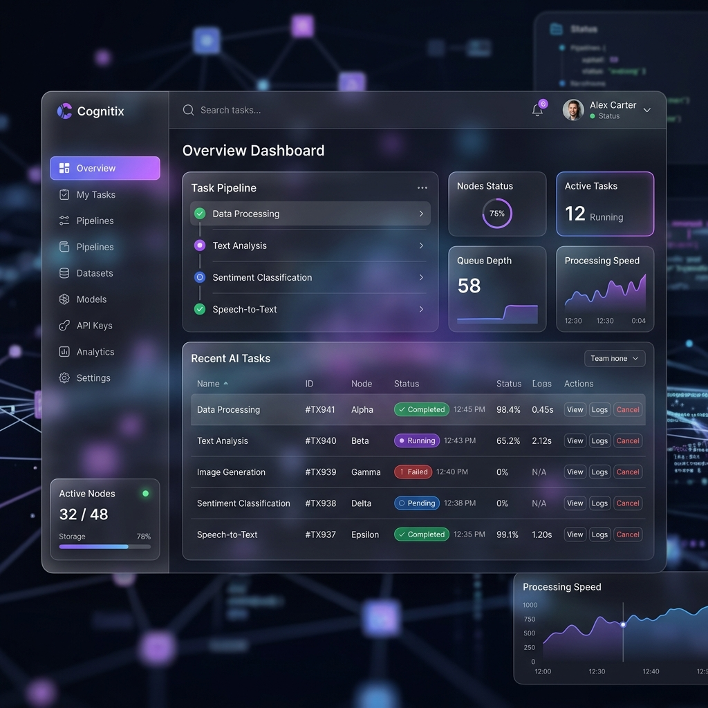

# 🚀 AI Task Processing Platform


A production-ready, scalable microservices architecture designed to handle asynchronous AI task processing. Built as a comprehensive full-stack assessment, this project demonstrates modern best practices in containerization, decoupled architectures, and continuous deployment.

## 🏗️ Architecture Overview

The system is designed with a decoupled architecture to ensure high availability and scalable background processing:

- **Frontend (Next.js 14+)**: A responsive, mobile-first React application utilizing App Router and Tailwind CSS. Features an elegant glassmorphic UI, JWT-based authentication, and real-time dashboard polling.
- **Backend API (Node.js & Express)**: A RESTful API responsible for user authentication (bcrypt + JWT) and task ingestion. It securely connects to MongoDB and pushes jobs to the Redis queue.
- **Background Worker (Python 3)**: A lightweight, asynchronous worker process. It uses `BRPOP` to listen to the Redis queue with zero-latency overhead, simulates complex AI processing, and updates the task state directly in MongoDB.
- **Message Broker (Redis)**: Acts as the high-speed in-memory queue separating the fast frontend API from the slow background worker.
- **Database (MongoDB)**: The persistent storage layer maintaining User accounts and Task states.

## 🛠️ Technology Stack

| Component | Technology |
|---|---|
| **Frontend** | Next.js 14, React, Tailwind CSS, Lucide Icons, Axios |
| **Backend** | Node.js 20, Express.js, Mongoose, bcrypt |
| **Worker** | Python 3.9, Redis-py, PyMongo |
| **Infrastructure** | Docker, Docker Compose |
| **CI/CD** | GitHub Actions |
| **GitOps** | Kubernetes, Argo CD *(Maintained in separate infrastructure repo)* |

---

## 💻 Local Development Setup

The easiest way to run the entire stack locally is via **Docker Compose**.

### Standard Local Execution
1. Clone the repository.
2. Ensure Docker Desktop is running.
3. Run the following command from the root directory:
   ```bash
   docker-compose up -d --build
   ```
4. Access the application:
   - Frontend UI: [http://localhost:3000](http://localhost:3000)
   - Backend API: `http://localhost:5000/api`

### ☁️ GitHub Codespaces Execution (Recommended)
This repository is fully optimized for GitHub Codespaces, guaranteeing zero local network/Docker issues.
1. Click **Code** -> **Codespaces** -> **Create codespace on main**.
2. Open the terminal and run:
   ```bash
   docker-compose up -d --build
   ```
3. Open the **Ports** tab in VS Code, and click the Globe icon next to **Port 3000** to view the application securely in your browser.

---

## 🚢 CI/CD & Deployment

### Automated Docker Builds
This project features a fully automated CI/CD pipeline built with **GitHub Actions** (`.github/workflows/ci-cd.yml`).
Upon every push to the `main` branch, the pipeline automatically:
1. Builds multi-stage, highly optimized Docker images for the Frontend, Backend, and Worker.
2. Authenticates with Docker Hub securely via GitHub Secrets.
3. Pushes the latest tagged images directly to the Docker Hub registry.

### Kubernetes & GitOps Ready
The application is designed for a Kubernetes deployment utilizing GitOps principles. The `ai-task-infra` repository contains all declarative Kubernetes manifests (Deployments, Services, and Horizontal Pod Autoscalers) configured for automated synchronization via **Argo CD**.
